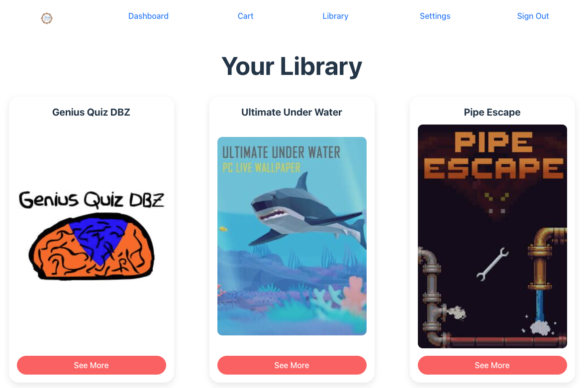

# Media Match App (Front End)

This repository contains the front-end code for **Media Match**, a MERN stack app that helps users build a game library based on their preferences, with future support for other media. It offers a simple interface for discovering new content.  

Developing this app allowed our team to showcase React’s strengths, including reusable components, `useContext`, `useEffect`, and service functions to connect our Express API and perform CRUD operations.  

## The Development Team
- Adam Paley: [GitHub](https://github.com/adampaley), [LinkedIn](https://www.linkedin.com/in/adampaley/)
- Ryan Deist: [GitHub](https://github.com/ryandeist), [LinkedIn](https://www.linkedin.com/in/ryantdeist/)
- Matt Hurst: [GitHub](https://github.com/mhurst66), [LinkedIn](https://www.linkedin.com/in/matthew-hurst-85627b56/)

## Overview
- This app runs on our [Media Match Express API](https://github.com/adampaley/mern-media-match-back-end) for back-end handling and the [IGDB API](https://api-docs.igdb.com/#getting-started) for game data.  
- It includes basic authorization with validation to prevent incorrect credentials or duplicate accounts.  
- Only signed-in users can access CRUD operations, while guests can only view the Landing, Sign-In, and Sign-Up pages.  
- Signed-in users can navigate five main sections:  
  - **Dashboard**: Fetches product data based on user settings, displaying one item at a time in CardDetails component. This CardDetails component renders conditionally and is used in the Library and Cart for similar purposes. In the card users can view product details, add (`CREATE`) items to their cart, or remove them from the queue.  
  - **Settings**: Users can set (`CREATE`) or adjust (`UPDATE`) content preferences via a settings drawer, filtering products by the API by genre. Preferences persist until changed.  
  - **Cart**: Displays (`READ`) added items. Users can "purchase" (`CREATE`) items into their library or remove (`DELETE`) them from the cart.  
  - **Library**: Shows (`READ`) purchased items. Users can remove (`UPDATE`) items or leave a review. The component is shared with the cart view, rendering conditionally.  
  - **Review**: Users can write (`CREATE`), read (`READ`), edit (`UPDATE`), or delete (`DELETE`) reviews.  
- User data, including settings, cart and purchases, persist after sign-out.
- Fully functional swipe allowing user to add product to cart or remove them.

[**Deployed App**](https://media-match.netlify.app/)

[**Back-End Repo**](https://github.com/adampaley/mern-media-match-back-end)

[**IGDB API**](https://api-docs.igdb.com/#getting-started)

## Planning Materials:
- [Trello Board](https://trello.com/b/a6q0CveD/mediamatch)
- [Excalidraw](https://excalidraw.com/#room=e85b8168469433527c79,5qeao3pG57lc7VZd0PgBRg)

## Attributions:
### APIs
- Game data is pulled from [IGDB API](https://api-docs.igdb.com/#getting-started)

### Assets
- [Nintendo Switch Pro Controller Icon](https://icons8.com/icon/51F0o6bWwYMt/nintendo-switch-pro-controller) by [Icons8](https://icons8.com)
- [Books Icon](https://icons8.com/icon/37814/books) by [Icons8](https://icons8.com)
- [Retro TV Icon](https://icons8.com/icon/2772/retro-tv) by [Icons8](https://icons8.com)
- [Music Note Icon](https://icons8.com/icon/12654/musical-note) by [Icons8](https://icons8.com)
- [Movie Camera Icon](https://icons8.com/icon/624/documentary) by [Icons8](https://icons8.com)
- [Settings Drawer UI](https://mui.com/material-ui/api/drawer/) by [Material UI](https://mui.com/)
- [Page Icon](https://pngtree.com/freepng/red-and-black-logo_5517319.html) by [PNG Tree](https://pngtree.com/)

### Libraries 
- Drawer component from [Material UI](https://mui.com/material-ui/react-drawer/)
- Swipe functionality from [Motion](https://motion.dev/docs/react-gestures)

    #### Icon and Logo
    - [Game Controller Icon](https://icons8.com/icon/JtRYpjtdhzhs/game-controller) by [Icons8](https://icons8.com)
    - [Book Stack Icon](https://icons8.com/icon/37815/book-stack) by [Icon8](https://icons8.com)
    - [Headphones Icon](https://icons8.com/icon/2768/headphones) by [Icon8](https://icons8.com)
    - [Remote Control Icon](https://icons8.com/icon/3703/remote-control) by [Icon8](https://icons8.com)
    - [Clapper Board Icon](https://icons8.com/icon/iCYNK0OSIxsw/clapper-board) by [Icon8](https://icons8.com)
    - [Tinder Icon](https://icons8.com/icon/118608/tinder) by [Icon8](https://icons8.com)

## Built with:

## Next Steps:
- Styling improvements (filter products by year, General UI improvements)
- Integrate Stripe Purchase Workflow
- Add Books, TV, Music, and Movies to available products.
- Social Network Functionality (Friend Feed, Friend List, Like/Dislike)
- Refined querying
- Useage of additional React features like useMemo and useCallback
- Unit Testing 